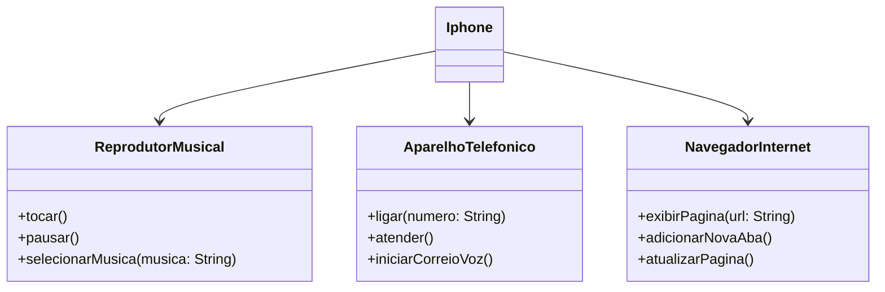

  <h1> Desafio UML </h1>

Este repositóriofoi criado com propósitos didáticos, representa um desafio proposto de modelagem e diagramação utilizando UML, criado em colaboração entre a [Digital Innovation One](https://www.dio.me/) e o Santander, como parte do Bootcamp Santander 2024 - Backend com Java

